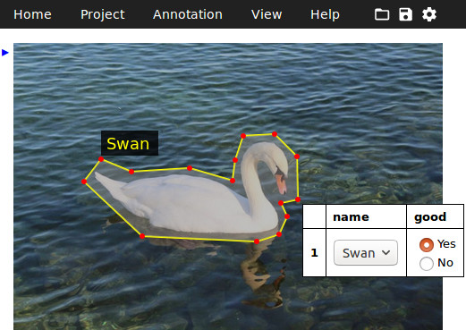
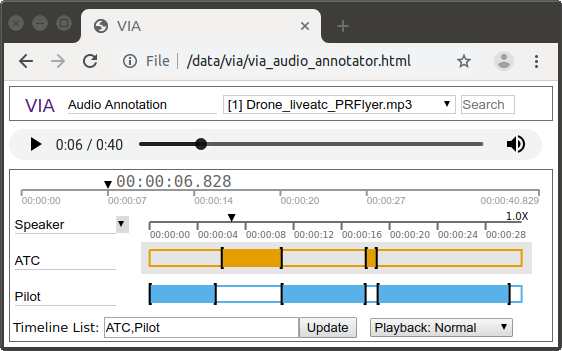
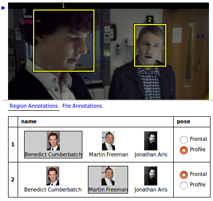
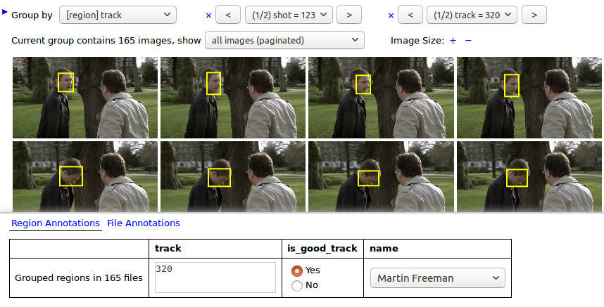

# VGG Image Annotator

VGG Image Annotator is a simple and standalone manual 
annotation software for image, audio and video. VIA runs in a web browser and
does not require any installation or setup. The complete VIA software fits in a 
single self-contained HTML page of size less than 400 Kilobyte that runs as an 
offline application in most modern web browsers.

VIA is an [open source](https://gitlab.com/vgg/via) project based solely on 
HTML, Javascript and CSS (no dependency on external libraries). VIA is 
developed at the [Visual Geometry Group](http://www.robots.ox.ac.uk/~vgg/) (VGG) 
and released under the BSD-2 clause [license](https://gitlab.com/vgg/via/blob/master/LICENSE)
which allows it to be useful for both academic projects and commercial applications.

## Screenshots






## Download
Detailed instructions for downloading the VIA software is available at http://www.robots.ox.ac.uk/~vgg/software/via/

## Demo
We have created self contained demo to illustrate the usage of VIA3. These demo
have been preloaded with some sample audio and video files. Furthermore, we have 
also added some sample manual annotations to these demo. These demo applications 
are very useful to get familiar with the commonly used features of VIA3.
  * [Basic Image Annotation Demo](http://www.robots.ox.ac.uk/~vgg/software/via/via_demo.html)
  * [Face Annotation Demo](http://www.robots.ox.ac.uk/~vgg/software/via/via_face_demo.html)
  * [Remote Image Annotation Demo](http://www.robots.ox.ac.uk/~vgg/software/via/via_wikimedia_demo.html)
  * [Face Track Annotation Demo](http://www.robots.ox.ac.uk/~vgg/software/via/docs/face_track_annotation.html)
  * [Video Annotator Demo](http://www.robots.ox.ac.uk/~vgg/software/via/demo/via_video_annotator.html)
  * [Audio Annotator Demo](http://www.robots.ox.ac.uk/~vgg/software/via/demo/via_audio_annotator.html)

## Open Source Ecosystem
The development of VIA software began in August 2016 and the first public
release of version 1 was made in April 2017. Many new advanced features
for image annotation were introduced in version 2 which was released in June 2018. 
Recently released version 3 of VIA software supports annotation of audio and video. 
As of May 2019, the VIA software has been used more than 600,000 times (+150,000 unique pageviews).

We have nurtured a large and thriving open source community which not
only provides feedback but also contributes code to add new features
and improve existing features in the VIA software. The open source
ecosystem of VIA thrives around its [source code repository](https://gitlab.com/vgg/via)
hosted by the Gitlab platform. Most of our users report issues and
request new features for future releases using the [issue portal](https://gitlab.com/vgg/via/issues). 
Many of our users not only submit bug reports but also suggest a potential
fix for these software issues. Some of our users also contribute code
to add new features to the VIA software using the [merge request portal](https://gitlab.com/vgg/via/merge_requests). 

We welcome all forms of contributions (code update, documentation, bug reports, etc) from users. 
Such contributions must must adhere to the existing [license](https://gitlab.com/vgg/via/blob/master/LICENSE) of 
the VIA project.

## Developer's Resources
VIA software is developed using HTML, CSS and Javascript and is based solely on 
standard features available in modern web browsers. 
VIA does not depend on any external libraries. These design
decisions has helped us create a very light weight and feature rich manaul
annotation software that can run on most modern web browsers without
requiring any installation or setup. The full VIA software sprouted from an
[early prototype](http://www.robots.ox.ac.uk/~vgg/software/via/via-0.0.1.txt)
of VIA which implemented a minimal -- yet functional -- image annotation tool
using only 40 lines of HTML/CSS/Javascript code that runs as
an offline application in most modern web browsers. This early prototype
provides a springboard for understanding the current codebase of VIA which
is just an extension of the early prototype. The [introductory tutorials](https://developer.mozilla.org/en-US/docs/Web/HTML) 
prepared by Mozilla is also very helpful in understanding the basic concepts of
HTML/CSS/Javascript platform.

The VIA source code repository contains a separate folder for each 
major version of VIA: [via-1.x.y](via-1.x.y/), [via-2.x.y](via-2.x.y/) and [via-3.x.y](via-3.x.y/).
The development of each version is carried out in a separate branch (e.g. [via-2.x.y branch](https://gitlab.com/vgg/via/tree/via-2.x.y).
If you wish to contribute code to VIA (we encourage you to do so), please send 
a pull request to one of the branches. Please do not send pull requests to the 
[master branch](https://gitlab.com/vgg/via/tree/master). All contributions
must adhere to the existing [license](LICENSE) of the VIA project.

We have prepared the following code documentation for each major version of VIA:
 * [Code Documentation for via-1.x.y](https://gitlab.com/vgg/via/blob/master/via-1.x.y/CodeDoc.md)
 * [Code Documentation for via-2.x.y](https://gitlab.com/vgg/via/blob/master/via-2.x.y/CodeDoc.md)
 * [Code Documentation for via-3.x.y](https://gitlab.com/vgg/via/blob/master/via-3.x.y/CodeDoc.md)

[Code review of via-1.0.0](https://gitlab.com/vgg/via/issues/54) was completed 
by @ecoto in Feb. 2017. Please [let us know](https://gitlab.com/vgg/via/issues/152) 
if you would like to contribute to VIA project by reviewing its software code.

## Citation
If you use this software, please cite it as shown below and acknowledge the Seebibyte grant as follows: "Development and maintenance of VGG Image Annotator (VIA) is supported by EPSRC programme grant Seebibyte: Visual Search for the Era of Big Data (EP/M013774/1)" 
```
@article{dutta2019vgg,
  title={{The VGG} Image Annotator ({VIA})},
  author={Dutta, Abhishek and Zisserman, Andrew},
  journal={arXiv preprint arXiv:1904.10699},
  year={2019}
}

@misc{ dutta2016via,
  author = "Dutta, A. and Gupta, A. and Zissermann, A.",
  title = "{VGG} Image Annotator ({VIA})",
  year = "2016",  
  howpublished = "http://www.robots.ox.ac.uk/~vgg/software/via/",  
  note = "Version: X.Y.Z, Accessed: INSERT_DATE_HERE" 
}
```

## Contact
Contact [Abhishek Dutta](adutta_remove_me_@robots.ox.ac.uk) for any queries or feedback related to this application.

## Acknowledgements
This work is supported by EPSRC programme grant Seebibyte: Visual Search for the Era of Big Data ( [EP/M013774/1](http://www.seebibyte.org/index.html) )

